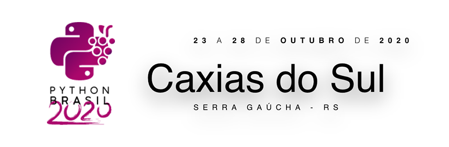

[](https://www.gnu.org/licenses/gpl-3.0)

> Página oficial da Python Brasil 2020 - Caxias do Sul/RS.

## Sobre o projeto

* **Tecnologias:** HTML, CSS (SCSS), JS, jQuery e Bootstrap 4
* **Metodologias:** BEM - CSS
* **Servidor:** Python

## Rodando o projeto

Para facilitar o desenvolvimento, você pode ativar o servidor local que irá atualizando o navegador a cada atualização dos estáticos da página.

### Configurando o servidor pela primeira vez

**Caso já tenha Virtualenv instalado, por favor, pule essa etapa:**

```sh
pip install virtualenv
```

Depois:

```sh
make local/create-env
```

```sh
source venv/bin/activate
```

```sh
make local/install
```

#### Ativando o servidor

```sh
make local/run-server
```

### Encerrando o servidor

```sh
deactivate
```

### Ativando o servidor (após ter encerrado, fechado e aberto novamente)

No diretório do projeto:

```sh
source venv/bin/activate
```

```sh
make local/run-server
```
